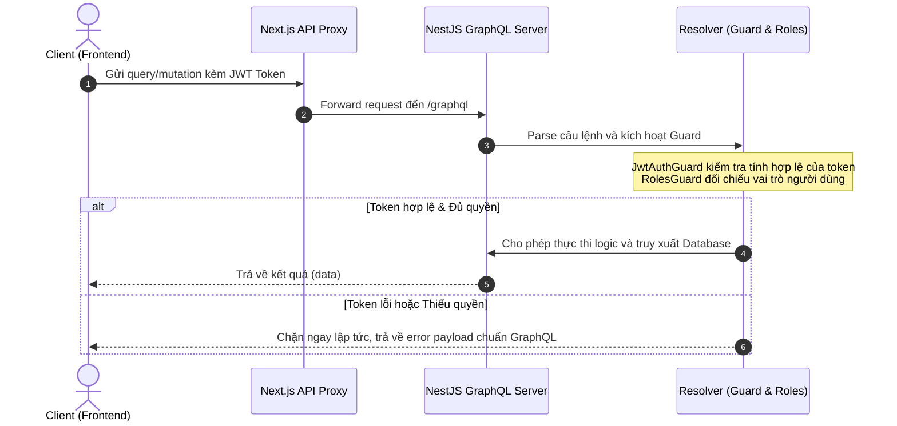

# Hướng Dẫn Xác Thực & Phân Quyền Trong GraphQL (NestJS & Next.js)

Tài liệu này mô tả chi tiết cách thức xác thực (Authentication) và phân quyền (Authorization) được thiết kế và vận hành đồng bộ giữa Backend (NestJS) và Frontend (Next.js) thông qua GraphQL API (`/graphql`).

---

## 1. Tổng Quan Kiến Trúc Bảo Mật

Dự án sử dụng cơ chế bảo mật **JSON Web Token (JWT)**. Mọi yêu cầu bảo mật từ Frontend gửi tới `/graphql` đều phải đính kèm chữ ký JWT thông qua Request Header `Authorization: Bearer <token>`.



---

## 2. Cấu Hình Xác Thực Phía Backend (NestJS)

Vì GraphQL sử dụng **Single Endpoint (`/graphql`)** chạy qua phương thức `POST`, việc phân quyền ở mức Router hay Middleware truyền thống sẽ không có tác dụng. NestJS giải quyết vấn đề này bằng cách đưa xác thực xuống **từng Query & Mutation** bên trong Resolver.

### A. Bộ Đôi Guards & Decorators Core
*   **`JwtAuthGuard`**: Đọc Token từ GraphQL context, verify chữ ký và gán thông tin `user` vào Request.
*   **`RolesGuard`**: Lấy danh sách các `Roles` được yêu cầu của Resolver và đối chiếu với `user.role` để phân quyền.

Cấu hình xử lý context GraphQL trong `JwtAuthGuard` ([jwt-auth.guard.ts](file:///d:/code/http/hoctuthien/backend/src/modules/auth/guards/jwt-auth.guard.ts)):
```typescript
getRequest(context: ExecutionContext) {
  if (context.getType<string>() === 'graphql') {
    const ctx = GqlExecutionContext.create(context);
    return ctx.getContext().req; // Lấy Express Request trong ngữ cảnh GraphQL
  }
  return context.switchToHttp().getRequest();
}
```

### B. Cách Áp Dụng Trong Resolver (`*.resolver.ts`)

Để phân quyền cho một query hoặc mutation cụ thể, sử dụng tổ hợp decorator `@UseGuards(JwtAuthGuard, RolesGuard)` và `@Roles(...)`:

#### 1. Yêu cầu quyền cụ thể (Ví dụ: ADMIN)
```typescript
@Mutation(() => Boolean, { name: 'removeMentorAvailability' })
@UseGuards(JwtAuthGuard, RolesGuard)
@Roles(Role.ADMIN) // Chỉ tài khoản có Role.ADMIN mới được thực thi
async remove(@Args('id', { type: () => ID }) id: string) {
  await this.mentorAvailabilityService.remove(id);
  return true;
}
```

#### 2. Cho phép nhiều quyền truy cập (Ví dụ: ADMIN hoặc MENTEE)
```typescript
@Mutation(() => MentorAvailability, { name: 'updateMentorAvailability' })
@UseGuards(JwtAuthGuard, RolesGuard)
@Roles(Role.ADMIN, Role.MENTEE) // Cho phép cả Admin và Mentee cập nhật
async update(
  @Args('id', { type: () => ID }) id: string,
  @Args('input') input: UpdateMentorAvailabilityGqlInput,
) {
  return this.mentorAvailabilityService.update(id, input);
}
```

#### 3. Cho phép truy cập công khai (Public)
Nếu query/mutation không khai báo Guard hoặc được đánh dấu `@Public()`, bất kỳ ai cũng có thể truy cập mà không cần đăng nhập:
```typescript
@Query(() => [GroupCategoryGql], { name: 'groupCategories' })
@Public() // Cho phép Guest xem danh mục nhóm khóa học
async getGroupCategories() {
  return this.groupCategoryService.findAll();
}
```

---

## 3. Cấu Hợp Gửi Token Phía Frontend (Next.js)

Tại Frontend, client sử dụng `graphql-request` để khởi tạo `gqlClient` tại [graphql-client.ts](file:///d:/code/http/hoctuthien/frontend/src/core/api/graphql-client.ts). 

Nhờ cơ chế **`requestMiddleware`**, mỗi khi Frontend gọi bất kỳ Query hay Mutation nào qua `gqlClient.request()`, client sẽ tự động lấy JWT từ Session hiện tại và đính kèm vào Header:

```typescript
export const gqlClient = new GraphQLClient(GQL_ENDPOINT, {
  requestMiddleware: async (request) => {
    let token = null;
    
    // Trích xuất token từ session hoạt động
    if (typeof window !== 'undefined') {
      const session = await getSession();
      token = (session as any)?.accessToken;
    } else {
      const { auth } = await import('@/auth');
      const session = await auth();
      token = (session as any)?.accessToken;
    }

    const headers: Record<string, string> = {
      'Content-Type': 'application/json',
      ...(request.headers as Record<string, string>),
    };

    if (token) {
      headers['Authorization'] = `Bearer ${token}`; // Đính kèm JWT token dạng Bearer
    }

    return { ...request, headers };
  },
});
```

---

## 4. Xử Lý Lỗi Xác Thực (GraphQL Error Response)

Khi xảy ra lỗi xác thực hoặc phân quyền, NestJS sẽ không trả về mã trạng thái HTTP là `401` hay `403` nữa. Thay vào đó, nó trả về HTTP Status `200 OK` (chuẩn GraphQL) nhưng đi kèm danh sách lỗi `errors` có định dạng chi tiết để Frontend dễ dàng bắt lỗi và hiển thị thông báo phù hợp:

```json
{
  "errors": [
    {
      "message": "You do not have permission. Required roles: admin",
      "code": "FORBIDDEN",
      "extensions": {
        "code": "FORBIDDEN",
        "statusCode": 403
      }
    }
  ],
  "data": null
}
```

---

## 5. Quy Tắc Vàng Khi Phát Triển

1.  **Luôn Securing Phía Backend trước**: Frontend chỉ che giấu UI trên trình duyệt, việc bảo vệ dữ liệu thực sự phải diễn ra ở Backend. Mọi Mutation thay đổi dữ liệu (create, update, delete) đều phải được bảo vệ bằng `@UseGuards(JwtAuthGuard, RolesGuard)` trừ các tác vụ đăng ký tài khoản.
2.  **Giữ Tính Nhất Quán Giữa REST và GraphQL**: Nếu một thực thể được bảo vệ bằng các Guard này bên phía REST Controller (ví dụ: `mentor-availability.controller.ts`), thì Resolver tương ứng (`mentor-availability.resolver.ts`) cũng phải được áp dụng chính xác các Guard và Roles tương tự.
