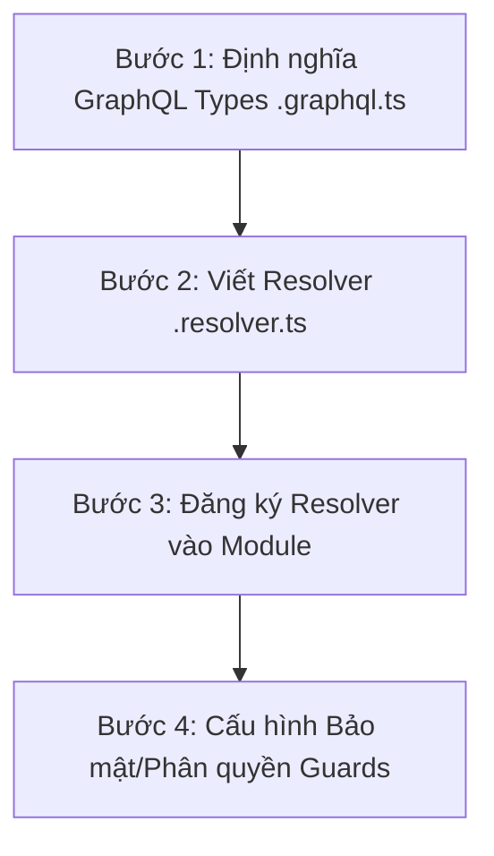
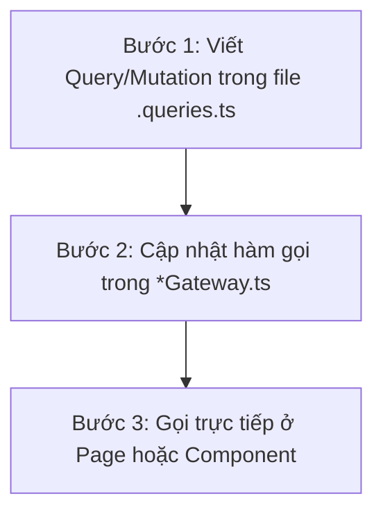

# Hướng Dẫn Tích Hợp & Sử Dụng GraphQL (Cho Cả Backend & Frontend)

Tài liệu này hướng dẫn cách phát triển các tính năng mới sử dụng **GraphQL** trong dự án, đảm bảo tính nhất quán giữa **Backend (NestJS)** và **Frontend (Next.js App Router)**.

---

## 📌 Tổng Quan Hệ Thống
Dự án sử dụng mô hình **Hybrid (REST + GraphQL)**:
*   **REST API**: Phù hợp cho các thao tác truyền thống, tải file, đăng nhập/đăng ký hoặc các nghiệp vụ đơn giản.
*   **GraphQL API**: Phù hợp cho các truy vấn dữ liệu phức tạp, trang dashboard, cần kết hợp dữ liệu từ nhiều thực thể khác nhau (ví dụ: lấy thông tin đăng ký Mentor đi kèm thông tin chi tiết của User).
*   **GraphQL Endpoint**: `/graphql`

---

## 🛠️ PHẦN I: HƯỚNG DẪN CHO BACKEND (NestJS)

Quy trình phát triển một tính năng GraphQL ở Backend gồm 4 bước chính:



### Bước 1: Định nghĩa GraphQL Types (`*.graphql.ts`)
Tất cả các kiểu dữ liệu gửi-nhận qua GraphQL phải được định nghĩa rõ ràng sử dụng decorator của thư viện `@nestjs/graphql`.

*   **Tạo file**: Đặt tại thư mục `types/` của module (Ví dụ: `backend/src/modules/mentor-availability/types/mentor-availability.graphql.ts`).
*   **Quy tắc khai báo**:
    *   Sử dụng `@ObjectType()` cho dữ liệu trả ra (Output).
    *   Sử dụng `@InputType()` cho dữ liệu gửi lên (Input của Mutation/Query).
    *   Sử dụng `@Field()` cho tất cả thuộc tính muốn phơi bày ra GraphQL.

```typescript
import { ObjectType, Field, ID, InputType } from '@nestjs/graphql';

// 1. Dữ liệu trả về (Output Type)
@ObjectType()
export class UserGql {
  @Field(() => ID)
  id: string;

  @Field()
  name: string;

  @Field({ nullable: true }) // Dùng nullable: true nếu trường này có thể null
  avatarUrl?: string;
}

@ObjectType()
export class ProductGql {
  @Field(() => ID)
  id: string;

  @Field()
  title: string;

  @Field(() => UserGql, { nullable: true }) // Quan hệ ảo với User
  creator?: UserGql;
}

// 2. Dữ liệu gửi lên (Input Type)
@InputType()
export class CreateProductGqlInput {
  @Field()
  title: string;
}
```

### Bước 2: Tạo và Viết Resolver (`*.resolver.ts`)
Resolver đóng vai trò tương tự như Controller trong REST API. Nó tiếp nhận các truy vấn (`Query`) và các hành động thay đổi dữ liệu (`Mutation`).

#### 1. Định nghĩa Query và Mutation cơ bản
```typescript
import { Resolver, Query, Mutation, Args, ID } from '@nestjs/graphql';
import { UseGuards } from '@nestjs/common';
import { JwtAuthGuard } from '../auth/guards/jwt-auth.guard';
import { RolesGuard } from '../auth/guards/roles.guard';
import { Roles } from '../../common/decorators/roles.decorator';
import { Role } from '../../common/enums/role.enum';

@Resolver(() => ProductGql)
export class ProductResolver {
  constructor(private readonly productService: ProductService) {}

  // Truy vấn lấy danh sách sản phẩm
  @Query(() => [ProductGql], { name: 'products' })
  @UseGuards(JwtAuthGuard, RolesGuard)
  @Roles(Role.ADMIN)
  async getProducts() {
    return this.productService.findAll();
  }
}
```

#### 2. Kỹ thuật Field Resolver (Liên kết quan hệ động)
Khi thực thể `Product` chỉ lưu `creatorId`, thay vì thực hiện `JOIN` phức tạp ở tầng Database hoặc Service, chúng ta có thể sử dụng `@ResolveField()` để lấy dữ liệu User từ `UserService` một cách độc lập:

```typescript
import { ResolveField, Parent } from '@nestjs/graphql';
import { UserService } from '../user/services/user.service';

@Resolver(() => ProductGql)
export class ProductResolver {
  constructor(
    private readonly productService: ProductService,
    private readonly userService: UserService, // Inject UserService
  ) {}

  // Định nghĩa trường liên kết 'creator' cho thực thể ProductGql
  @ResolveField('creator', () => UserGql, { nullable: true })
  async getCreator(@Parent() product: ProductGql) {
    try {
      // @Parent() chứa dữ liệu của bản ghi Product hiện tại
      return await this.userService.findOne(product.creatorId);
    } catch {
      return null; // Trả về null nếu có lỗi để tránh làm sập toàn bộ Query lớn
    }
  }
}
```

> [!NOTE]
> **Field Resolver** cực kỳ mạnh mẽ vì nó chỉ được chạy khi phía Frontend **thực sự yêu cầu** trường `creator` trong câu Query. Nếu FE không yêu cầu, hàm `getCreator` sẽ không bao giờ được chạy ➡️ Giảm thiểu tải cho Server.

### Bước 3: Đăng ký Resolver vào Module (`*.module.ts`)
Nhớ thêm Resolver và các Service liên quan vào danh sách `providers` của module tương ứng:

```typescript
@Module({
  imports: [UserModule], // Import UserModule để dùng được UserService
  providers: [ProductResolver, ProductService],
})
export class ProductModule {}
```

### Bước 4: Lưu ý quan trọng cho Backend Developer ⚠️
1.  **Không bọc Response của GraphQL**: Tránh dùng các REST Interceptor bọc ngoài GraphQL. Nếu hệ thống có Interceptor định dạng chung (ví dụ: bọc dạng `{ statusCode, message, data }`), bạn phải kiểm tra và bỏ qua nếu là GraphQL request:
    ```typescript
    if (context.getType<string>() === 'graphql') {
      return next.handle();
    }
    ```
2.  **Xử lý lỗi**: Tương tự, tại `HttpExceptionFilter`, nếu phát hiện là GraphQL request, hãy `throw exception;` trực tiếp để module GraphQL tự động định dạng lỗi theo chuẩn `errors` của GraphQL.

---

## 🌐 PHẦN II: HƯỚNG DẪN CHO FRONTEND (Next.js)

Quy trình sử dụng GraphQL ở Frontend gồm các bước chính sau:



### Bước 1: Viết câu Query / Mutation (`*.queries.ts`)
Tạo một file chứa các câu truy vấn GraphQL đặt tại thư mục gateway hoặc thư mục tương ứng của tính năng (Ví dụ: `frontend/src/core/gateway/product.queries.ts`).

Sử dụng thư viện `graphql-request` để định nghĩa:

```typescript
import { gql } from 'graphql-request';

// Query lấy toàn bộ sản phẩm
export const GET_PRODUCTS_QUERY = gql`
  query GetProducts {
    products {
      id
      title
      creator { # Yêu cầu lấy thêm thông tin người tạo thông qua Field Resolver ở BE
        id
        name
        avatarUrl
      }
    }
  }
`;

// Mutation tạo sản phẩm mới
export const CREATE_PRODUCT_MUTATION = gql`
  mutation CreateProduct($input: CreateProductGqlInput!) {
    createProduct(input: $input) {
      id
      title
    }
  }
`;
```

### Bước 2: Định nghĩa hàm gọi trong Gateway (`*Gateway.ts`)
Import `gqlClient` từ `@/core/api/graphql-client` và thực hiện gọi API qua câu query đã định nghĩa:

```typescript
import { gqlClient } from '../api/graphql-client';
import { GET_PRODUCTS_QUERY, CREATE_PRODUCT_MUTATION } from './product.queries';

export const productGateway = {
  // Thực hiện Query lấy dữ liệu
  async getAllProducts(): Promise<any> {
    const result = await gqlClient.request<any>(GET_PRODUCTS_QUERY);
    return result.products; // Tên biến khớp với tên Query trong file graphql
  },

  // Thực hiện Mutation thay đổi dữ liệu có truyền tham số (Variables)
  async createProduct(title: string): Promise<any> {
    const result = await gqlClient.request<any>(CREATE_PRODUCT_MUTATION, {
      input: { title },
    });
    return result.createProduct;
  }
};
```

> [!TIP]
> **Về `gqlClient`**: Chúng ta đã tích hợp sẵn tính năng **tự động lấy Token**. 
> Bất kể câu lệnh được chạy trên **Server Component (SSR)** hay ở **Client Component (Trình duyệt)**, `gqlClient` sẽ tự động lấy Token hiện tại của User từ Next-Auth và đính kèm vào Header `Authorization: Bearer <token>` để gửi lên Backend.

### Bước 3: Sử dụng dữ liệu trong React Components / Pages

#### 1. Trong React Server Component (Mặc định của Next.js App Router)
Bạn có thể gọi trực tiếp Gateway dạng `async/await` ngay trong Page component để lấy dữ liệu về render trực tiếp từ Server:

```tsx
// frontend/src/app/admin/products/page.tsx
import { productGateway } from "@/core/gateway/productGateway";

export default async function AdminProductsPage() {
  let products = [];
  try {
    products = await productGateway.getAllProducts();
  } catch (error) {
    console.error("Lỗi lấy danh sách sản phẩm:", error);
  }

  return (
    <div>
      <h1>Quản lý sản phẩm</h1>
      <ul>
        {products.map((product: any) => (
          <li key={product.id}>
            {product.title} - Tạo bởi: {product.creator?.name || "N/A"}
          </li>
        ))}
      </ul>
    </div>
  );
}
```

#### 2. Trong Client Component (Có dùng `"use client"`)
Nếu gọi ở Client-side, bạn sử dụng `useEffect` hoặc kết hợp với React Query / SWR như các API thông thường:

```tsx
"use client";

import { useEffect, useState } from "react";
import { productGateway } from "@/core/gateway/productGateway";

export default function ProductList() {
  const [products, setProducts] = useState([]);

  useEffect(() => {
    productGateway.getAllProducts()
      .then(setProducts)
      .catch(console.error);
  }, []);

  return (
    <div>
      {/* Render giao diện ở đây */}
    </div>
  );
}
```

---

## 🌟 QUY TẮC VÀNG KHI LÀM VIỆC VỚI GRAPHQL (Golden Rules)

1.  **Chỉ yêu cầu những gì cần dùng**:
    *   *Frontend*: Tuyệt đối không query thừa các trường không sử dụng trên giao diện. Ví dụ, nếu chỉ hiển thị `name`, đừng query thêm `email`, `avatarUrl`, hay `createdAt` của User.
2.  **Đặt nullable hợp lý**:
    *   Với những trường liên kết ảo hoặc không chắc chắn có dữ liệu trong Database (như avatar, mô tả thêm, chứng chỉ học tập), bắt buộc phải khai báo `{ nullable: true }` trong `@Field()`.
3.  **Tách biệt logic xử lý lỗi**:
    *   Khi viết **Field Resolver** (như liên kết User, liên kết thực thể phụ), hãy bọc trong khối `try/catch` để nếu lỗi khi lấy thực thể liên kết, trường đó sẽ trả về `null` thay vì làm sập toàn bộ câu truy vấn lớn của trang.
4.  **Đặt tên rõ ràng**:
    *   Tên Query/Mutation nên đặt theo cấu trúc động từ + danh từ (Ví dụ: `query GetMyMentorAvailabilities`, `mutation CreateMentorAvailability`).
